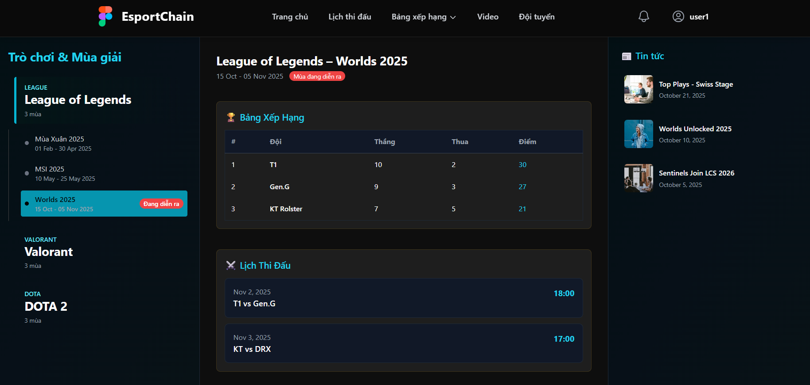
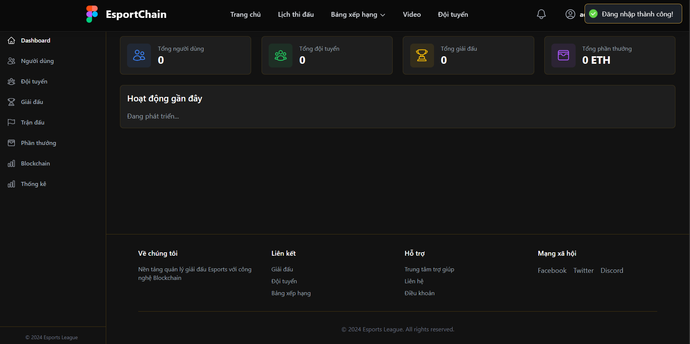
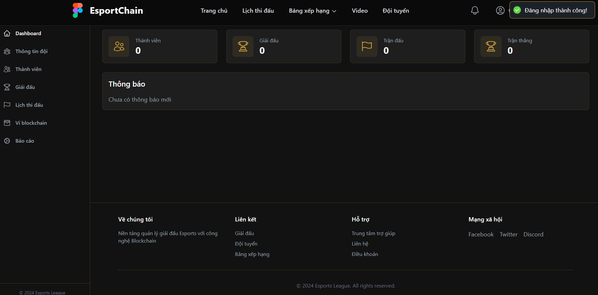

# eSports Ranking System với Blockchain & JWT Security Analysis

## Giới thiệu

Hệ thống quản lý và xếp hạng eSports với tính năng lưu trữ bảng xếp hạng trên blockchain (đảm bảo tính minh bạch và không thể thay đổi). Đồng án kết hợp với đề tài **Web An Toàn**: Phân tích và khai thác lỗ hổng JWT bị ký sai hoặc không an toàn - demo crack JWT HS256 với key yếu.

### Tính năng chính

- Quản lý giải đấu, đội tuyển, cầu thủ
- Bảng xếp hạng được lưu trữ trên Blockchain (immutable)
- Phân tích bảo mật JWT: Demo khai thác JWT HS256 với thuật toán ký yếu
- Hệ thống phân phối phần thưởng qua Smart Contract
- Phân quyền: Admin, Team Manager, Player, User
- Kết nối ví blockchain (MetaMask)

---

## Công nghệ sử dụng

### Frontend
- **Framework**: React.js 18+ với Vite
- **Styling**: Tailwind CSS
- **State Management**: Zustand
- **Routing**: React Router DOM v6
- **UI Components**: Headless UI, Heroicons
- **Blockchain**: Ethers.js
- **HTTP Client**: Axios
- **Notifications**: React Hot Toast

### Backend
- **Runtime**: Node.js (Express.js)
- **Database**: MySQL
- **Authentication**: JWT (JSON Web Token) - **có demo lỗ hổng HS256**
- **Blockchain**: Web3.js / Ethers.js
- **ORM/Query**: Raw SQL hoặc Sequelize
- **Security**: bcrypt, cors, helmet

### Blockchain
- **Network**: Ethereum Testnet (Sepolia/Goerli) hoặc Hardhat Local
- **Smart Contract**: Solidity
- **Wallet**: MetaMask

---

## Cấu trúc thư mục

### Frontend Structure
```
esports-ranking-frontend/
├── public/
│   └── assets/images/          # Hình ảnh tĩnh
├── src/
│   ├── assets/                 # Tài nguyên (images, icons, styles)
│   ├── components/
│   │   ├── common/            # Components tái sử dụng (Button, Modal, Table...)
│   │   ├── layout/            # Layout components (Header, Sidebar, Footer)
│   │   ├── auth/              # Components xác thực (LoginForm, RegisterForm)
│   │   ├── tournament/        # Components giải đấu
│   │   ├── team/              # Components đội tuyển
│   │   ├── player/            # Components cầu thủ
│   │   └── blockchain/        # Components blockchain (WalletConnect, Rewards)
│   ├── pages/
│   │   ├── public/            # Trang công khai (Home, Leaderboard)
│   │   ├── auth/              # Trang đăng nhập/đăng ký
│   │   ├── admin/             # Dashboard Admin
│   │   ├── team-manager/      # Dashboard Team Manager
│   │   ├── player/            # Dashboard Player
│   │   └── user/              # Dashboard User
│   ├── services/              # API services (authService, tournamentService...)
│   ├── hooks/                 # Custom React Hooks
│   ├── context/               # React Context (AuthContext, Web3Context)
│   ├── store/                 # Zustand store (state management)
│   ├── routes/                # Route definitions
│   ├── utils/                 # Utility functions (validators, formatters, blockchain)
│   ├── App.jsx
│   └── main.jsx
├── .env.example               # Environment variables template
├── package.json
└── tailwind.config.js
```

### Backend Structure
```
esports-ranking-backend/
├── src/
│   ├── config/
│   │   ├── config.js          # Database & app configuration
│   │   └── passport.js        # JWT strategy (có demo lỗ hổng)
│   ├── constant/
│   │   ├── ErrorCodes.js      # Error codes
│   │   ├── messageConstants.js # Message templates
│   │   └── roles.js           # User roles
│   ├── controllers/
│   │   ├── GameController.js  # Game/Tournament logic
│   │   ├── TeamController.js  # Team management
│   │   └── UserController.js  # User management
│   ├── helper/
│   │   ├── MailHelper.js      # Email utilities
│   │   └── MessageResponse.js # Response formatter
│   ├── middlewares/
│   │   ├── jwt_token.js       # JWT verification (SECURE)
│   │   └── jwt_token1.js      # JWT với lỗ hổng HS256 (DEMO)
│   ├── models/                # Database models
│   │   ├── Game.js
│   │   ├── Team.js
│   │   ├── User.js
│   │   ├── Tournament.js
│   │   ├── Ranking.js
│   │   └── Wallet.js
│   ├── response/
│   │   └── ResponseSuccess.js # Success response format
│   ├── routes/
│   │   ├── auth.route.js      # Authentication routes
│   │   ├── game.route.js      # Game/Tournament routes
│   │   ├── team.route.js      # Team routes
│   │   └── user.route.js      # User routes
│   ├── services/
│   │   ├── GameService.js     # Business logic cho games
│   │   ├── TeamService.js     # Business logic cho teams
│   │   └── UserService.js     # Business logic cho users
│   ├── views/                 # Email templates (nếu có)
│   └── server.js              # Entry point
├── contracts/                 # Smart contracts (Solidity)
├── scripts/                   # Deployment scripts
├── test/                      # Unit tests
├── .env                       # Environment variables
├── package.json
└── hardhat.config.js          # Hardhat config (nếu dùng)
```

---

## Hướng dẫn cài đặt & chạy

###  Yêu cầu môi trường

- **Node.js**: v18.x trở lên
- **npm** hoặc **yarn**
- **MySQL**: v8.0 trở lên
- **MetaMask**: Extension cho trình duyệt
- **Hardhat** (optional): Nếu chạy blockchain local

###  1. Clone repository

```bash
git clone <repository-url>
cd project_esports
```

###  2. Cài đặt Database

#### Tạo database MySQL

```sql
CREATE DATABASE esports_ranking;
USE esports_ranking;
```

#### Import database

```bash
mysql -u root -p esports_ranking < database/esports_ranking.sql
```

Hoặc import trực tiếp qua phpMyAdmin/MySQL Workbench.

#### Database Schema (các bảng chính)

- `users` - Người dùng (role: admin, team_manager, player, user)
- `teams` - Đội tuyển
- `team_members` - Thành viên đội
- `tournaments` - Giải đấu
- `matches` - Trận đấu
- `rankings` - Bảng xếp hạng (có hash blockchain)
- `wallets` - Ví blockchain của user/team
- `transactions` - Lịch sử giao dịch phần thưởng

### 🔧 3. Cấu hình Backend

#### Di chuyển vào thư mục backend

```bash
cd esports-ranking
```

#### Cài đặt dependencies

```bash
npm install
```

#### Tạo file `.env`

Copy từ `.env.example` và điền thông tin:

```env
# Server
PORT=5000
NODE_ENV=development

# Database
DB_HOST=localhost
DB_PORT=3306
DB_USER=root
DB_PASSWORD=your_password
DB_NAME=esports_ranking

# JWT Settings
JWT_SECRET=your_super_secret_key_here
JWT_WEAK_SECRET=weak123        # Key yếu để demo lỗ hổng
JWT_EXPIRES_IN=7d

# Blockchain
BLOCKCHAIN_NETWORK=sepolia
PRIVATE_KEY=your_private_key
CONTRACT_ADDRESS=deployed_contract_address
INFURA_API_KEY=your_infura_key

# Email (optional)
SMTP_HOST=smtp.gmail.com
SMTP_PORT=587
SMTP_USER=your_email@gmail.com
SMTP_PASS=your_app_password
```

#### Chạy backend

```bash
cd esports-ranking
npm npm run dev
```

Server sẽ chạy tại: `http://localhost:8081`

###  4. Cấu hình Frontend

#### Di chuyển vào thư mục frontend

```bash
cd ../frontend_bxh_esport

#### Cài đặt dependencies

```bash
npm install
```

#### Tạo file `.env`

```env
VITE_API_BASE_URL=http://localhost:5000/api
VITE_BLOCKCHAIN_NETWORK=sepolia
VITE_CONTRACT_ADDRESS=deployed_contract_address
```

#### Chạy frontend

```bash
npm run dev
```

Frontend sẽ chạy tại: `http://localhost:5173`

###  5. Deploy Smart Contract (Optional - Local Blockchain)

Nếu muốn chạy blockchain local:

```bash
cd esports-ranking
npx hardhat node                    # Terminal 1: Chạy local blockchain
npx hardhat run scripts/deploy.js   # Terminal 2: Deploy contract
```

Copy contract address vào file `.env` của cả backend và frontend.

---

##  Tài khoản demo

Sử dụng các tài khoản sau để đăng nhập:

| Role | Username | Password | Mô tả |
|------|----------|----------|-------|
| **Admin** | `admin` | `Admin12@` | Quản trị hệ thống, quản lý giải đấu, phân phối rewards |
| **Team Manager** | `team` | `team1234@` | Quản lý đội tuyển, đăng ký giải đấu |
| **Player** | `player1` | `player123` | Cầu thủ trong đội, xem lịch thi đấu |
| **User** | `user1` | `user123@` | Người xem, theo dõi giải đấu |

###  Demo JWT Vulnerability

#### Endpoint với lỗ hổng (sử dụng HS256 key yếu):

```
POST /api/auth/login-vulnerable
```


#### Cách khai thác:

---

##  Kết quả và giao diện

### 1. Trang chủ - Danh sách giải đấu

*Hiển thị các giải đấu đang diễn ra và sắp tới*

### 2. Bảng xếp hạng Blockchain

*Bảng xếp hạng được lưu trữ trên blockchain, có hash để verify*

### 3. Dashboard Admin

*Quản lý giải đấu, cập nhật kết quả, phân phối rewards*

### 4. Team Manager - Quản lý đội tuyển

*Quản lý thành viên, đăng ký giải đấu, xem lịch sử trận đấu*

### 5. JWT Security Demo

*Demo crack JWT HS256 với key yếu - So sánh token secure vs vulnerable*


##  Bảo mật JWT - Phân tích

### Lỗ hổng JWT HS256

**File demo**: `src/middlewares/jwt_token1.js`

#### Vấn đề:
- Sử dụng secret key yếu: `"123456"`
- Dễ bị brute-force
- Attacker có thể tạo token giả mạo với role cao hơn

#### Cách phòng tránh:
 Sử dụng secret key phức tạp (>256 bit)  
 Sử dụng RS256 (asymmetric) thay vì HS256  
 Implement token rotation  
 Thêm claims validation (exp, iat, aud, iss)  
✅ Rate limiting cho login attempts  

###  Implementation an toàn

**File secure**: `src/middlewares/jwt_token.js`

```javascript
// Secret key mạnh (256-bit)
const JWT_SECRET = crypto.randomBytes(32).toString('hex');

// Add more claims
const token = jwt.sign(
  { 
    userId: user.id, 
    role: user.role,
    iat: Math.floor(Date.now() / 1000),
    exp: Math.floor(Date.now() / 1000) + (60 * 60 * 24) // 24h
  }, 
  JWT_SECRET,
  { algorithm: 'HS256' }
);
```
